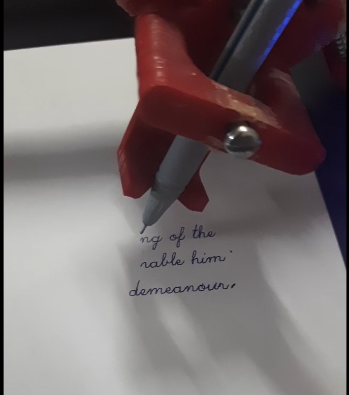

# ✏️ Two-Axis Drawing Machine

<p align="center">
  
</p>

<p align="center">
  <strong>CAD • Embedded Systems • Motion Control • 2D Plotting</strong>
</p>

---

## 📌 Overview

A compact **two-axis drawing machine** designed to convert digital drawings into physical sketches using coordinated X-Y motion.

The system uses stepper motors and a pen mechanism to accurately move across a 2D workspace.

---

## ⚙️ How It Works

```text
Digital Drawing
      ↓
Motion Commands
      ↓
┌───────────────┐
│ X-Y Controller│
└───────┬───────┘
        ↓
 Stepper Motors
        ↓
 X-Y Movement
        ↓
   Pen Mechanism
        ↓
    Drawing
```

---

## 🧩 Main Components

- Stepper Motors
- Stepper Motor Drivers
- Microcontroller
- X-Y Mechanical System
- Pen Holder
- Power Supply

---

## 🛠️ Technologies

- **C / Embedded Programming**
- **Stepper Motor Control**
- **CAD Modelling**
- **2-Axis Motion Control**
- **3D Printing & Fabrication**

---

## 📸 Project

<p align="center">
  
</p>

---

## 🚀 Future Improvements

- Higher drawing accuracy
- Automatic pen lifting
- Improved motion control
- G-code support
- Larger drawing workspace
- Computer-controlled drawing

---

## 👨‍💻 Author

**Priyansh Sharma**

Mechatronics Engineering Student  
Robotics • AI • Embedded Systems • Mechanical Design
